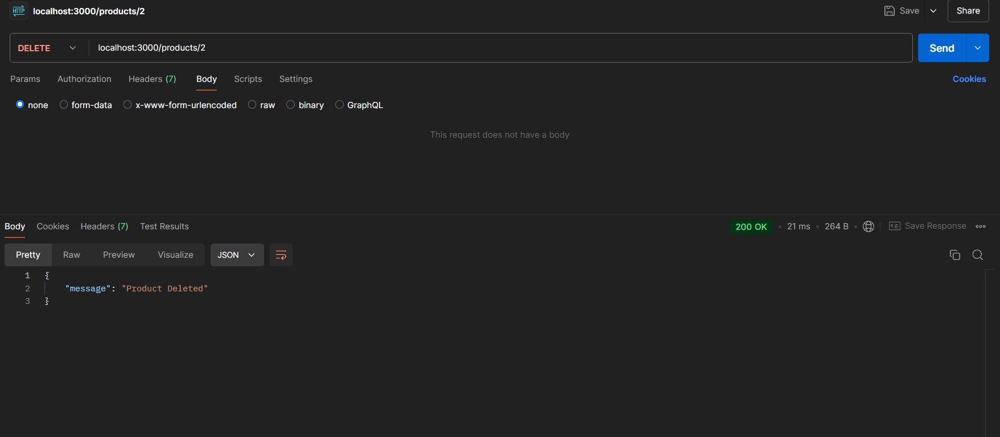

# Product Inventory RESTful API Documentation

## Overview

This REST API allows users to manage a basic inventory of products, including functionality to create, retrieve, update, delete, and sort products. The API is built using Node.js and Express.js, with in-memory storage for product data.

## Project Structure

- **Language**: JavaScript (Node.js)
- **Framework**: Express.js
- **Storage**: In-memory storage using an array

## API Endpoints

### Base URL

```
http://localhost:3000
```

---

### 1. GET `/products`

**Description**: Fetches a list of all products. Optionally allows sorting by `name` or `price` in ascending or descending order.

**Query Parameters**:

- `sortBy` (optional): `name` or `price`
- `order` (optional): `asc` or `desc` (default is `asc`)

**Example Request**:

```
GET /products?sortBy=price&order=desc
```

**Response**:
```json
[
    {
        "id": 1,
        "name": "Sample Product",
        "description": "This is a sample product",
        "price": 100,
        "quantity": 10
    },
    ...
]
```


---

### 2. GET `/products/:id`

**Description**: Fetches details of a specific product by ID.

**URL Parameter**:
- `id`: The ID of the product to retrieve.

**Example Request**:

```
GET /products/1
```

**Response**:
- **200 OK**: Returns the product if found.
    ```json
    {
        "id": 1,
        "name": "Sample Product",
        "description": "This is a sample product",
        "price": 100,
        "quantity": 10
    }
    ```
- **404 Not Found**: If the product does not exist.
    ```json
    {
        "message": "Product not found"
    }
    ```
Product Found -

Product Not Found -

---

### 3. POST `/products`

**Description**: Adds a new product to the inventory.

**Request Body**:
- `name` (string, required): The product name.
- `description` (string, optional): The product description.
- `price` (number, required): The product price.
- `quantity` (number, optional): The product quantity.

**Example Request**:
```json
{
    "name": "New Product",
    "description": "Description of the new product",
    "price": 150,
    "quantity": 20
}
```

**Response**:
- **201 Created**: Returns the newly created product object with a unique `id`.
    ```json
    {
        "id": 2,
        "name": "New Product",
        "description": "Description of the new product",
        "price": 150,
        "quantity": 20
    }
    ```
- **400 Bad Request**: If required fields are missing or invalid.
    ```json
    {
        "message": "Name is required and must be a string"
    }
    ```
Successful POST - 

Inconsistent data type POST - 

---

### 4. PUT `/products/:id`

**Description**: Updates an existing product by ID.

**URL Parameter**:
- `id`: The ID of the product to update.

**Request Body**:
- Any of the following fields can be updated: `name` (string), `description` (string), `price` (number), `quantity` (number).

**Example Request**:
```json
{
    "name": "Updated Product",
    "price": 120
}
```

**Response**:
- **200 OK**: Returns the updated product object.
    ```json
    {
        "id": 1,
        "name": "Updated Product",
        "description": "This is a sample product",
        "price": 120,
        "quantity": 10
    }
    ```
- **404 Not Found**: If the product does not exist.
    ```json
    {
        "message": "Product not found"
    }
    ```


---

### 5. DELETE `/products/:id`

**Description**: Deletes a product by ID.

**URL Parameter**:
- `id`: The ID of the product to delete.

**Response**:
- **200 OK**: Returns a message confirming deletion.
    ```json
    {
        "message": "Product deleted"
    }
    ```
- **404 Not Found**: If the product does not exist.
    ```json
    {
        "message": "Product not found"
    }
    ```
Products before deletion -


Deletion -


Product after deletion


---

## Error Handling

The API provides appropriate error messages and HTTP status codes:
- **400 Bad Request**: For invalid input data (e.g., missing `name` or `price` in `POST /products`).
- **404 Not Found**: For non-existent products in `GET`, `PUT`, or `DELETE` requests.

## Testing

All endpoints were tested using Postman. Screenshots of the test results for each endpoint have been included.

---

## Optional Sorting Functionality

The API allows sorting products by `price` or `name` in ascending or descending order. This is achieved by providing `sortBy` and `order` query parameters in the `GET /products` endpoint.

## Conclusion

This RESTful API successfully meets all assignment requirements by implementing CRUD operations, in-memory data storage, error handling, and optional sorting functionality. The API is ready for integration or further enhancements as needed.